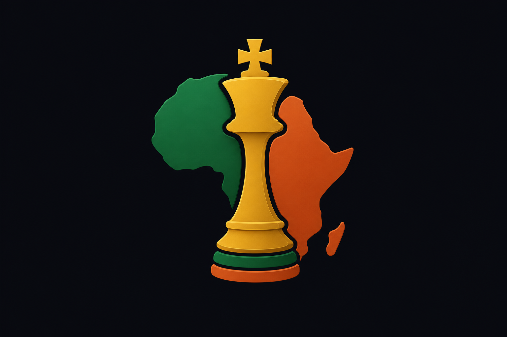
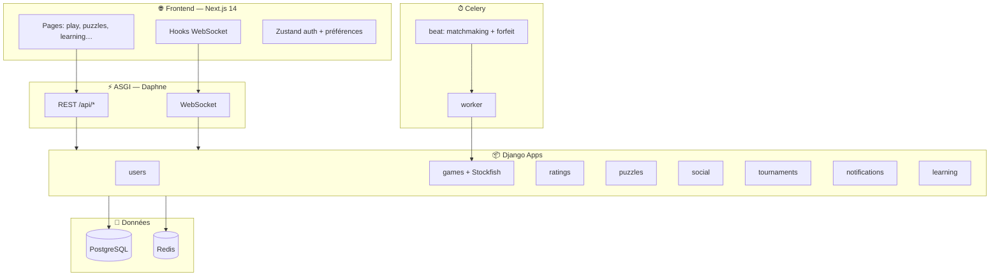
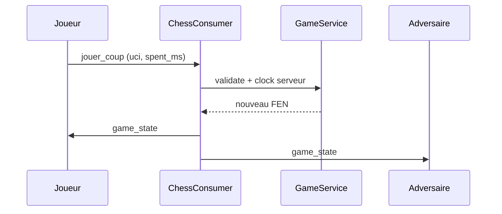

<div align="center">

<!-- Bannière animée -->


<br />



<br />

<!-- Ligne animée typewriter -->
<a href="https://git.io/typing-svg">
  
</a>

<br />

[](https://www.djangoproject.com/)
[](https://nextjs.org/)
[](docs/WEBSOCKET_MULTIPLAYER.md)
[](https://stockfishchess.org/)
[](https://www.postgresql.org/)
[](https://redis.io/)
[](docker-compose.yml)
[](.github/workflows/ci.yml)

<br />

**Plateforme d'échecs en ligne** — identité africaine forte, ingénierie de niveau mondial, ouverte au monde.

| | |
|:---:|:---|
| **Développeur** | **Maxime Dzidula KELI** |
| **Contact** | [WhatsApp +33 7 54 83 00 39](https://wa.me/33754830039) |
| **Application** | [http://localhost:3000](http://localhost:3000) (dev) |
| **API / Swagger** | [http://localhost:8000/api/docs/](http://localhost:8000/api/docs/) |

[🚀 Démarrage rapide](#-démarrage-rapide) ·
[✨ Fonctionnalités](#-fonctionnalités) ·
[🏗 Architecture](#️-architecture) ·
[🔌 API & WebSocket](#-api--websocket) ·
[🎨 Design](#-design-system) ·
[📚 Documentation](#-documentation) ·
[🗺 Roadmap](#️-roadmap)


</div>

---

## 🌍 Vision

**AFRICHESS** vise à devenir la référence des échecs en ligne pour l'Afrique et la diaspora : parties en direct, entraînement structuré, tournois communautaires, et mise en avant des talents du continent — avec une expérience comparable aux grandes plateformes internationales.

---

## ✨ Fonctionnalités

### ♟ Jeu & moteur

| Fonctionnalité | Description |
|----------------|-------------|
| **Parties humaines** | WebSocket temps réel, chrono serveur (Fischer), nulle, revanche |
| **Matchmaking** | File d'attente par mode + ELO, appariement Celery (toutes les 5 s) |
| **Vs ordinateur** | 10 niveaux Stockfish, ELO adaptatif, commentaires coach (FR) |
| **Analyse** | Post-partie : meilleurs coups, gaffes, eval |
| **Reprise** | `localStorage` + API partie active |
| **Promotion** | Dialogue dame / tour / fou / cavalier |
| **Annuler (IA)** | 1 ou 2 coups selon réponse moteur |
| **Observateur** | `/live` + `/watch/[id]` en lecture seule |

### 🧩 Puzzles & apprentissage

| Fonctionnalité | Description |
|----------------|-------------|
| **Problème du jour** | Puzzle quotidien + validation |
| **Entraînement** | Lots par difficulté |
| **Rush** | 5 puzzles enchaînés |
| **Classement puzzles** | Top résolveurs |
| **Curriculum** | **40 leçons** long format (~20 pages/doc) — `seed_full_curriculum` |
| **Coach IA** | Conseils dashboard + analyse PGN |
| **XP & badges** | Progression cours, badge `course_first` |

### 👥 Social & compétition

| Fonctionnalité | Description |
|----------------|-------------|
| **Amis** | Demandes, acceptation, défis directs |
| **Messages privés** | Chat 1-to-1 sur `/friends` |
| **Chat partie** | REST + WS en jeu humain |
| **Clubs** | Liste publique par pays |
| **Tournois** | Arène / suisse simplifié, standings, « Ma partie » |
| **Notifications** | Cloche REST + **push WebSocket** instantané |
| **Classements** | Mondial + **africain** (filtre par pays) |

### 🛡 Plateforme & ops

| Fonctionnalité | Description |
|----------------|-------------|
| **Auth** | JWT, inscription, **OAuth Google / GitHub** → `/auth/callback` |
| **i18n** | EN · FR · AR · PT · SW (menu + hero) |
| **Thèmes** | Plateaux (classiques + fleuris ♣), pièces « africaines » |
| **PWA** | `manifest.json`, mode faible bande passante |
| **Anti-triche** | Limite coups/min, intervalle minimum |
| **Rate limit** | DRF throttling anon / user |
| **CI** | GitHub Actions : tests backend, lint, **E2E Playwright** |

---

## 🏗 Architecture



### Structure du dépôt

```
AFRICHESS/
├── backend/                      # Django 5 + DRF + Channels + Celery
│   ├── config/                   # settings, ASGI, URLs
│   └── apps/
│       ├── users/                # Profils, OAuth adapter, JWT
│       ├── games/                # Parties, WS, chrono, anti-triche, IA
│       ├── ratings/              # ELO par mode, leaderboards
│       ├── puzzles/              # Daily, training, rush, leaderboard
│       ├── social/               # Amis, clubs, chat, DM
│       ├── tournaments/          # Arène, suisse, standings
│       ├── notifications/        # REST + push WS (signals)
│       └── learning/             # Cours, 40 docs, coach, PGN
├── frontend/                     # Next.js 14, TypeScript, Tailwind
│   ├── src/app/                  # Routes App Router
│   ├── src/components/           # Échiquier, layout, learning…
│   ├── e2e/                      # Playwright (login → partie IA)
│   └── public/                   # Logo, manifest PWA
├── docker-compose.yml            # db, redis, backend, celery, beat, frontend
├── .github/workflows/ci.yml      # Tests + lint + E2E
└── docs/                         # Guides détaillés
```

---

## 🚀 Démarrage rapide

### Prérequis

- [Docker](https://docs.docker.com/get-docker/) & Docker Compose
- Ports libres : **3000** (front), **8000** (API), **5433** (Postgres), **6379** (Redis)

### Installation en 3 commandes

```bash
git clone <votre-repo> AFRICHESS && cd AFRICHESS
cp .env.example .env    # adapter SECRET_KEY, OAuth si besoin
docker compose up --build
```

| Service | URL |
|---------|-----|
| **Application** | http://localhost:3000 |
| **API REST** | http://localhost:8000/api/ |
| **Swagger UI** | http://localhost:8000/api/docs/ |
| **Admin Django** | http://localhost:8000/admin/ |

### Données de démo (optionnel)

```bash
docker compose exec backend python manage.py seed_puzzles
docker compose exec backend python manage.py seed_learning
docker compose exec backend python manage.py seed_full_curriculum
docker compose exec backend python manage.py seed_tournaments
```

### Variables frontend (`.env` ou `docker-compose`)

```env
NEXT_PUBLIC_API_URL=http://localhost:8000/api
NEXT_PUBLIC_WS_URL=ws://localhost:8000
NEXT_PUBLIC_API_ORIGIN=http://localhost:8000
```

### Tests

```bash
# Backend (38 tests)
docker compose exec backend python manage.py test \
  apps.games.tests apps.notifications.tests apps.social.tests \
  apps.tournaments.tests apps.learning.tests

# E2E (backend + frontend requis)
cd frontend && npm ci && npx playwright install chromium
npm run test:e2e
```

<details>
<summary><b>🔧 Développement sans Docker</b></summary>

Voir le guide complet : [docs/SETUP.md](docs/SETUP.md)

- Backend : `pip install -r backend/requirements.txt`, Postgres + Redis locaux, `daphne config.asgi:application`
- Frontend : `cd frontend && npm install && npm run dev`
- Celery : `celery -A config worker -l info` + `celery -A config beat -l info`

</details>

---

## 🔌 API & WebSocket

### REST (extrait)

| Méthode | Endpoint | Rôle |
|---------|----------|------|
| `POST` | `/api/auth/login/` | JWT access + refresh |
| `POST` | `/api/users/register/` | Création compte |
| `GET` | `/api/games/live/` | Parties humaines en cours |
| `POST` | `/api/games/{id}/move/` | Coup (REST fallback) |
| `POST` | `/api/games/{id}/draw/` | Proposer nulle |
| `POST` | `/api/games/{id}/rematch/` | Revanche |
| `GET` | `/api/puzzles/daily/` | Puzzle du jour |
| `GET` | `/api/learning/dashboard/` | Parcours + coach |
| `GET` | `/api/tournaments/` | Liste tournois |

Référence complète : [docs/API.md](docs/API.md)

### WebSocket (JWT dans `?token=`)

| Canal | URL | Usage |
|-------|-----|--------|
| **Partie** | `ws://host/ws/game/<uuid>/?token=JWT` | Coups, chrono, fin de partie |
| **Matchmaking** | `ws://host/ws/matchmaking/?token=JWT` | File → `match_found` |
| **Notifications** | `ws://host/ws/notifications/?token=JWT` | Snapshot + `new_notification` |



Détails protocole : [docs/WEBSOCKET_MULTIPLAYER.md](docs/WEBSOCKET_MULTIPLAYER.md)

### OAuth (production)

1. Configurer `GOOGLE_OAUTH_CLIENT_ID`, `GOOGLE_OAUTH_CLIENT_SECRET`, `GITHUB_*`, `FRONTEND_URL`
2. Redirect URI : `https://api.votredomaine.com/accounts/google/login/callback/`
3. Boutons login → redirection → `/auth/callback?access=…&refresh=…`

Guide : [docs/DEPLOYMENT.md](docs/DEPLOYMENT.md)

---

## 🎨 Design system

<table>
<tr>
<td align="center" width="120"><br/><b>Gold</b><br/><code>#D4A017</code><br/>CTA, accents</td>
<td align="center" width="120"><br/><b>Green</b><br/><code>#1B7A3D</code><br/>Succès, terre</td>
<td align="center" width="120"><br/><b>Terracotta</b><br/><code>#C45C26</code><br/>Alertes chaudes</td>
<td align="center" width="120"><br/><b>Night</b><br/><code>#0D1117</code><br/>Fond sombre</td>
</tr>
</table>

- **Typo display** : titres `font-display`, dégradés or → vert
- **Composants** : cartes `glass-card`, boutons `african-gradient`
- **Échiquier** : thèmes classiques + jardins fleuris ; pièces Unicode « africaines »
- **Assets** : logo, motifs inspirés Kente

---

## 📱 Pages principales

| Route | Description |
|-------|-------------|
| `/` | Accueil hero, CTA jouer / puzzle |
| `/play` | IA, matchmaking WS, chrono, chat, analyse |
| `/live` | Liste parties en direct |
| `/watch/[id]` | Mode observateur |
| `/puzzles` | Daily, training, rush, classement |
| `/learning` | Dashboard, cours, leçons markdown + FEN |
| `/learning/analyze` | Import PGN |
| `/friends` | Amis, défis, **messages privés** |
| `/clubs` | Clubs par pays |
| `/tournaments` | Inscription, start, standings |
| `/leaderboard` | Mondial / africain + filtre pays |
| `/community` | Joueurs africains mis en avant |
| `/profile` | Avatar, niveau, thèmes plateau |
| `/auth/callback` | Retour OAuth JWT |

---

## 📚 Documentation

| Document | Contenu |
|----------|---------|
| [docs/SETUP.md](docs/SETUP.md) | Installation détaillée, dépannage |
| [docs/DEPLOYMENT.md](docs/DEPLOYMENT.md) | Prod, HTTPS/WSS, Celery, OAuth |
| [docs/API.md](docs/API.md) | Endpoints REST |
| [docs/WEBSOCKET_MULTIPLAYER.md](docs/WEBSOCKET_MULTIPLAYER.md) | Protocole WS multijoueur |
| [docs/LEARNING.md](docs/LEARNING.md) | Module pédagogique |
| [docs/CURRICULUM_40_DOCUMENTS.md](docs/CURRICULUM_40_DOCUMENTS.md) | Programme 40 leçons |
| [docs/FEATURES_ROADMAP.md](docs/FEATURES_ROADMAP.md) | Feuille de route 20 points |

---

## 🗺 Roadmap

<details open>
<summary><b>✅ Livré</b></summary>

- [x] Multijoueur WebSocket + chrono serveur
- [x] Matchmaking Celery + forfait déconnexion
- [x] Tournois arène / suisse, observateur
- [x] Puzzles rush + leaderboard
- [x] Curriculum 40 documents + UI leçons
- [x] Notifications push WS
- [x] OAuth Google / GitHub + callback JWT
- [x] CI + tests étendus + E2E Playwright
- [x] Messages privés UI

</details>

<details>
<summary><b>🔶 En cours / à venir</b></summary>

- [ ] Pièces SVG illustrées (style africain)
- [ ] i18n complet de toutes les pages
- [ ] Apps mobiles (React Native)
- [ ] Intégration rating FIDE
- [ ] Push notifications natives (APNs / FCM)
- [ ] Streaming live avancé

</details>

---

## 🐳 Services Docker

| Service | Rôle |
|---------|------|
| `db` | PostgreSQL 16 |
| `redis` | Channels + broker Celery |
| `backend` | Daphne (HTTP + WebSocket) |
| `celery` | Tâches async |
| `celery-beat` | Matchmaking périodique, forfaits |
| `frontend` | Next.js 14 |

---

## 👤 Crédits & licence

<table>
<tr>
<td>

**AFRICHESS** — © 2026  
Conçu et développé par **Maxime Dzidula KELI**

Projet **propriétaire**. Tous droits réservés.

</td>
<td align="center">

[](https://wa.me/33754830039)

</td>
</tr>
</table>

<div align="center">


**♟ Jouez. Apprenez. Brillez. — AFRICHESS**

</div>
