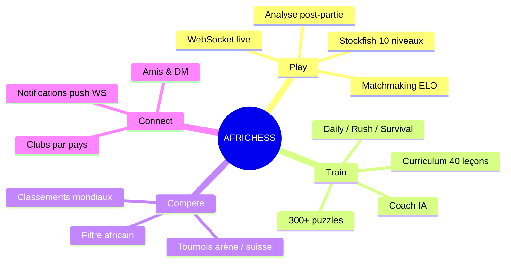
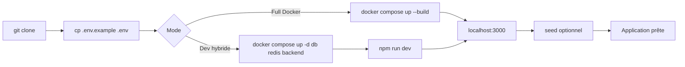
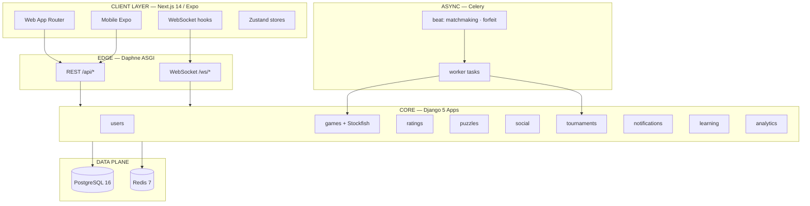
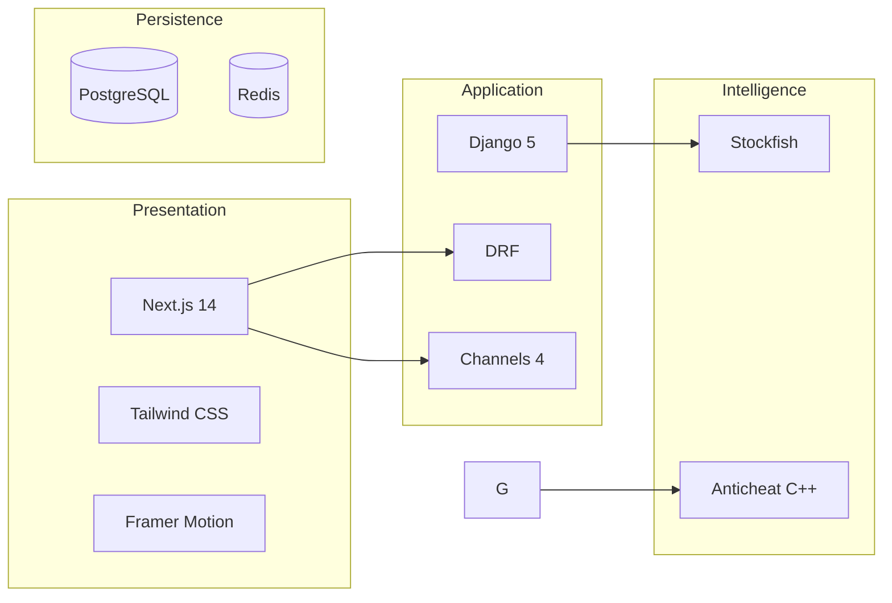
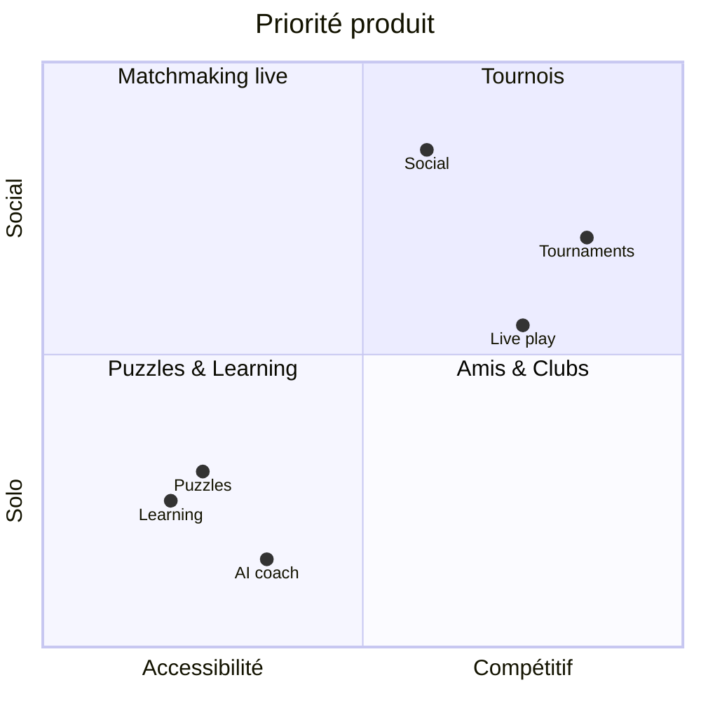
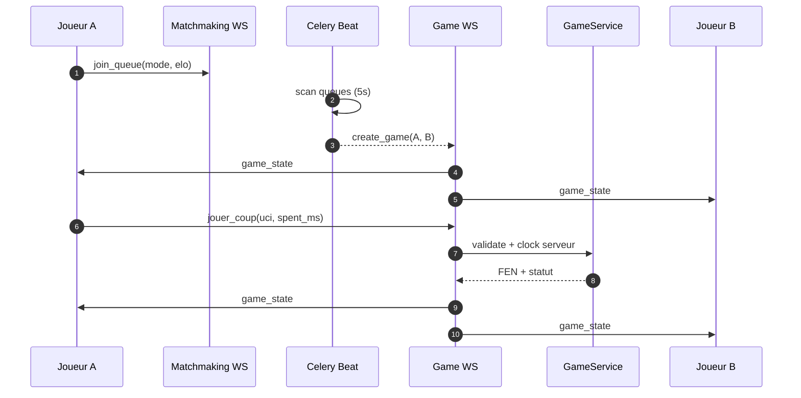
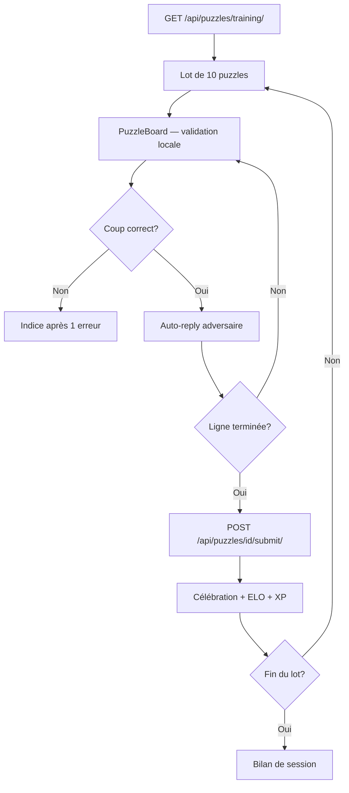
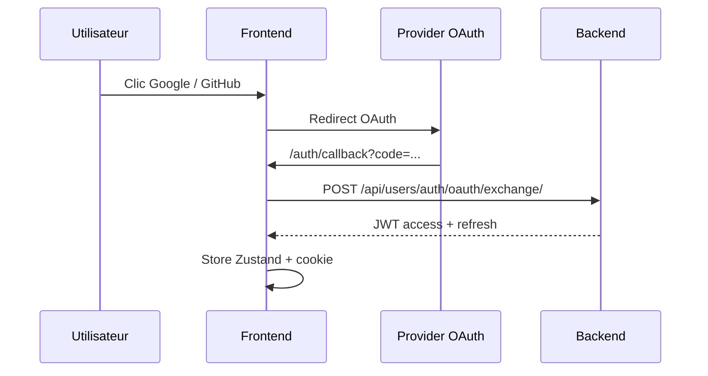
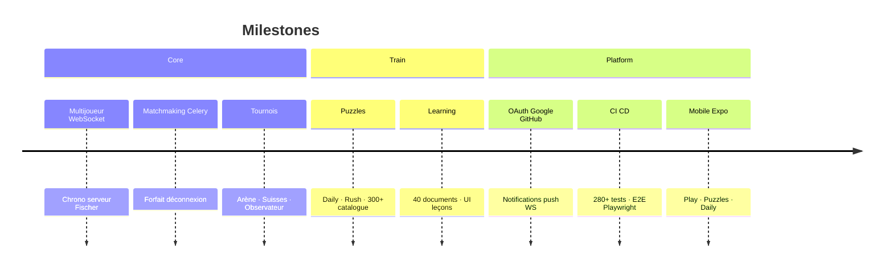
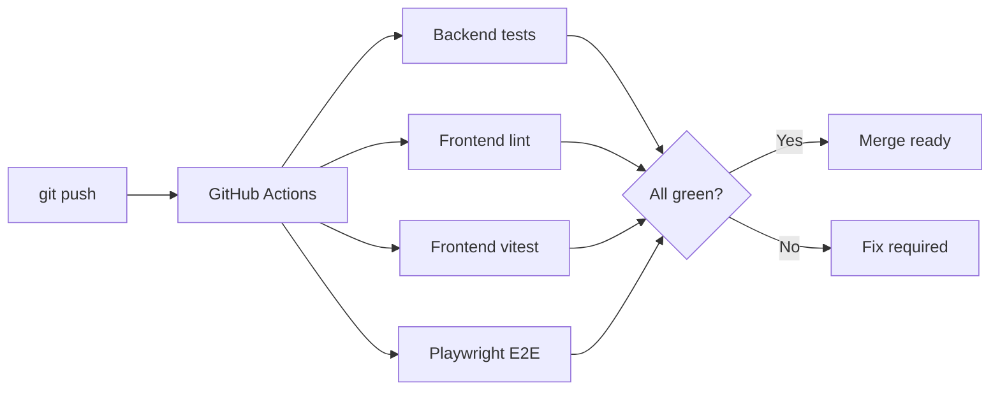

<div align="center">


<br />


<br />


<br />

[](https://www.djangoproject.com/)
[](https://nextjs.org/)
[](docs/WEBSOCKET_MULTIPLAYER.md)
[](https://stockfishchess.org/)
[](https://www.postgresql.org/)
[](https://redis.io/)
[](docker-compose.yml)
[](.github/workflows/ci.yml)

<br />

**Plateforme d'échecs en ligne** — identité visuelle africaine, ingénierie temps réel, ouverte au monde entier.

<br />

| | |
|:---:|:---|
| **Architecte** | Maxime Dzidula KELI |
| **Contact** | [WhatsApp +33 7 54 83 00 39](https://wa.me/33754830039) |
| **Application** | [localhost:3000](http://localhost:3000) |
| **API / Swagger** | [localhost:8000/api/docs/](http://localhost:8000/api/docs/) |

<br />

[`Démarrage`](#démarrage) · [`Architecture`](#architecture) · [`Fonctionnalités`](#fonctionnalités) · [`Flux temps réel`](#flux-temps-réel) · [`API`](#api--websocket) · [`Design`](#design-system) · [`Routes`](#routes) · [`Docs`](#documentation) · [`Roadmap`](#roadmap)


</div>

---

## Vision

**AFRICHESS** construit une couche logicielle complète autour des échecs : jeu humain synchronisé, entraînement tactique, parcours pédagogique, tournois et réseau social — avec une expérience comparable aux grandes plateformes internationales, ancrée dans une esthétique et une communauté africaines.


```mermaid
mindmap
  root((AFRICHESS))
    Play
      WebSocket live
      Matchmaking ELO
      Stockfish 10 niveaux
      Analyse post-partie
    Train
      300+ puzzles
      Daily / Rush / Survival
      Curriculum 40 leçons
      Coach IA
    Compete
      Tournois arène / suisse
      Classements mondiaux
      Filtre africain
    Connect
      Amis & DM
      Clubs par pays
      Notifications push WS
```

---

## Démarrage

### Prérequis

| Ressource | Version | Port |
|-----------|---------|------|
| Docker + Compose | récent | — |
| Node.js | 20+ | 3000 (front) |
| Python | 3.12+ | 8000 (API) |
| PostgreSQL | 16 | 5433 |
| Redis | 7 | 6379 |

### Une commande — dev hybride (recommandé)

Backend containerisé, frontend local avec hot-reload :

```bash
docker compose up -d db redis backend && cd frontend && npm run dev
```

Première installation frontend : `cd frontend && npm install`

Cache Next.js corrompu (page blanche, 404 assets) :

```bash
cd frontend && npm run dev:clean
```

> **Attention** — ne pas lancer simultanément le conteneur `frontend` Docker et `npm run dev` local : conflit sur le port **3000**.

### Stack complète Docker

```bash
git clone <votre-repo> AFRICHESS && cd AFRICHESS
cp .env.example .env
docker compose up --build
```

### Pipeline de bootstrap


```mermaid
flowchart LR
    A[git clone] --> B[cp .env.example .env]
    B --> C{Mode}
    C -->|Dev hybride| D[docker compose up -d db redis backend]
    C -->|Full Docker| E[docker compose up --build]
    D --> F[npm run dev]
    E --> G[localhost:3000]
    F --> G
    G --> H[seed optionnel]
    H --> I[Application prête]
```

### Endpoints locaux

| Service | URL |
|---------|-----|
| Application | http://localhost:3000 |
| API REST | http://localhost:8000/api/ |
| Swagger UI | http://localhost:8000/api/docs/ |
| Admin Django | http://localhost:8000/admin/ |

### Données de démo

```bash
docker compose exec backend python manage.py seed_puzzles --download   # 300+ puzzles (Lichess CC0)
docker compose exec backend python manage.py seed_learning
docker compose exec backend python manage.py seed_full_curriculum      # 40 leçons long format
docker compose exec backend python manage.py seed_tournaments
docker compose exec backend python manage.py createsuperuser
```

### Variables frontend

```env
NEXT_PUBLIC_API_URL=http://localhost:8000/api
NEXT_PUBLIC_WS_URL=ws://localhost:8000
NEXT_PUBLIC_API_ORIGIN=http://localhost:8000
NEXT_PUBLIC_MEDIA_ORIGIN=http://localhost:8000
```

### Tests

```bash
# Backend — 10 apps Django
docker compose exec backend python manage.py test \
  apps.analytics.tests apps.games.tests apps.notifications.tests \
  apps.social.tests apps.tournaments.tests apps.learning.tests \
  apps.users.tests apps.ratings.tests apps.puzzles.tests

# Frontend unitaire
cd frontend && npm run test

# E2E Playwright (backend + frontend actifs)
cd frontend && npm ci && npx playwright install chromium
npm run test:e2e
```

<details>
<summary><strong>Développement sans Docker</strong></summary>

Guide complet : [docs/SETUP.md](docs/SETUP.md)

| Composant | Commande |
|-----------|----------|
| Backend | `pip install -r backend/requirements.txt` puis `daphne config.asgi:application` |
| Frontend | `cd frontend && npm install && npm run dev` |
| Celery worker | `celery -A config worker -l info` |
| Celery beat | `celery -A config beat -l info` |
| Stockfish | `STOCKFISH_PATH=/usr/games/stockfish` |

</details>


---

## Architecture

### Vue système


```mermaid
flowchart TB
    subgraph CLIENT["CLIENT LAYER — Next.js 14 / Expo"]
        WEB[Web App Router]
        MOB[Mobile Expo]
        WS_C[WebSocket hooks]
        ZST[Zustand stores]
    end

    subgraph EDGE["EDGE — Daphne ASGI"]
        REST[REST /api/*]
        WSS[WebSocket /ws/*]
    end

    subgraph CORE["CORE — Django 5 Apps"]
        U[users]
        G[games + Stockfish]
        R[ratings]
        PU[puzzles]
        SO[social]
        TO[tournaments]
        NO[notifications]
        LE[learning]
        AN[analytics]
    end

    subgraph DATA["DATA PLANE"]
        PG[(PostgreSQL 16)]
        RD[(Redis 7)]
    end

    subgraph ASYNC["ASYNC — Celery"]
        BEAT[beat: matchmaking · forfeit]
        WRK[worker tasks]
    end

    WEB --> REST
    MOB --> REST
    WS_C --> WSS
    REST --> CORE
    WSS --> CORE
    CORE --> PG
    CORE --> RD
    BEAT --> WRK
    WRK --> G
    WRK --> TO
```

### Stack technique


```mermaid
flowchart LR
    subgraph Presentation
        N[Next.js 14]
        T[Tailwind CSS]
        F[Framer Motion]
    end
    subgraph Application
        D[Django 5]
        DRF[DRF]
        CH[Channels 4]
    end
    subgraph Intelligence
        SF[Stockfish]
        AC[Anticheat C++]
    end
    subgraph Persistence
        PG[(PostgreSQL)]
        RD[(Redis)]
    end
    N --> DRF
    N --> CH
    D --> SF
    G --> AC
```

### Structure du dépôt

```
AFRICHESS/
├── backend/
│   ├── config/                 settings · ASGI · URLs · Celery
│   └── apps/
│       ├── users/                JWT · OAuth · profils · 2FA TOTP
│       ├── games/                parties · WS · chrono Fischer · IA
│       ├── ratings/              ELO multi-mode · leaderboards
│       ├── puzzles/              daily · training · rush · battle · survival
│       ├── social/               amis · clubs · chat · DM
│       ├── tournaments/          arène · suisse · standings
│       ├── notifications/        REST + push WebSocket
│       ├── learning/             cours · 40 docs · coach · PGN
│       └── analytics/            métriques · événements
├── frontend/
│   ├── src/app/                  App Router (pages)
│   ├── src/components/           échiquier · puzzles · learning
│   ├── src/lib/                  API · WS · moteur puzzle · i18n
│   └── e2e/                      Playwright
├── mobile/                       Expo — play · puzzles · daily
├── anticheat-cpp/                moteur Fair Play post-partie
├── docker-compose.yml
├── .github/workflows/ci.yml
└── docs/
```

### Services Docker

| Service | Image / build | Rôle |
|---------|---------------|------|
| `db` | PostgreSQL 16 | Persistance relationnelle |
| `redis` | Redis 7 | Channels layer · broker Celery |
| `backend` | Django + Daphne | HTTP REST + WebSocket |
| `celery` | worker | tâches asynchrones |
| `celery-beat` | scheduler | matchmaking 5s · forfaits déconnexion |
| `frontend` | Next.js 14 | UI production (port 3000) |


---

## Fonctionnalités

### Jeu & moteur

| Module | Capacités |
|--------|-----------|
| **Multijoueur** | WebSocket bidirectionnel, chrono serveur Fischer, nulle, revanche |
| **Matchmaking** | File par mode + ELO, appariement Celery toutes les 5 s |
| **Vs moteur** | 10 niveaux Stockfish, ELO adaptatif, commentaires coach FR |
| **Analyse** | Post-partie : meilleurs coups, gaffes, évaluation |
| **Reprise** | Persistance `localStorage` + API partie active |
| **Promotion** | Dialogue dame / tour / fou / cavalier |
| **Annulation IA** | 1 ou 2 coups selon réponse moteur |
| **Spectateur** | `/live` + `/watch/[id]` lecture seule |

### Puzzles & apprentissage

| Module | Capacités |
|--------|-----------|
| **Daily** | Puzzle quotidien, streak, partage |
| **Training** | Lots de 10 par difficulté / thème, bilan de session |
| **Rush** | Enchaînement chronométré, score + misses |
| **Survival / Battle** | Modes compétitifs avancés |
| **Catalogue** | 300+ puzzles (seed Lichess CC0 + catalogue local) |
| **Curriculum** | 40 leçons long format (~20 pages/doc) |
| **Coach IA** | Conseils dashboard + analyse PGN |
| **Progression** | XP, badges, ELO puzzle |

### Social & compétition

| Module | Capacités |
|--------|-----------|
| **Amis** | Demandes, acceptation, défis directs |
| **Messages** | Chat privé 1-to-1 sur `/friends` |
| **Chat partie** | REST + WebSocket en jeu humain |
| **Clubs** | Liste publique filtrée par pays |
| **Tournois** | Arène / suisse, standings, « Ma partie » |
| **Notifications** | Cloche REST + push WebSocket instantané |
| **Classements** | Mondial + filtre africain par pays |

### Plateforme

| Module | Capacités |
|--------|-----------|
| **Auth** | JWT · inscription · OAuth Google / GitHub → `/auth/callback` |
| **i18n** | EN · FR · AR · PT · SW |
| **Thèmes** | Plateaux classiques + jardins fleuris · pièces stylisées |
| **PWA** | `manifest.json` · mode faible bande passante |
| **Anti-triche** | Limite coups/min · intervalle minimum · moteur C++ |
| **Rate limit** | DRF throttling anon / user |
| **CI** | GitHub Actions : tests · lint · E2E Playwright |

### Matrice fonctionnelle


```mermaid
quadrantChart
    title Priorité produit
    x-axis Accessibilité --> Compétitif
    y-axis Solo --> Social
    quadrant-1 Tournois
    quadrant-2 Matchmaking live
    quadrant-3 Puzzles & Learning
    quadrant-4 Amis & Clubs
    Puzzles: [0.25, 0.3]
    Learning: [0.2, 0.25]
    Live play: [0.75, 0.55]
    Tournaments: [0.85, 0.7]
    Social: [0.6, 0.85]
    AI coach: [0.35, 0.15]
```


---

## Flux temps réel

### Cycle d'une partie multijoueur


```mermaid
sequenceDiagram
    autonumber
    participant A as Joueur A
    participant MM as Matchmaking WS
    participant C as Celery Beat
    participant G as Game WS
    participant S as GameService
    participant B as Joueur B

    A->>MM: join_queue(mode, elo)
    C->>C: scan queues (5s)
    C-->>G: create_game(A, B)
    G->>A: game_state
    G->>B: game_state
    A->>G: jouer_coup(uci, spent_ms)
    G->>S: validate + clock serveur
    S-->>G: FEN + statut
    G->>A: game_state
    G->>B: game_state
```

### Flux puzzle (entraînement)


```mermaid
flowchart TD
    A[GET /api/puzzles/training/] --> B[Lot de 10 puzzles]
    B --> C[PuzzleBoard — validation locale]
    C --> D{Coup correct?}
    D -->|Non| E[Indice après 1 erreur]
    D -->|Oui| F[Auto-reply adversaire]
    F --> G{Ligne terminée?}
    G -->|Non| C
    G -->|Oui| H[POST /api/puzzles/id/submit/]
    H --> I[Célébration + ELO + XP]
    I --> J{Fin du lot?}
    J -->|Non| B
    J -->|Oui| K[Bilan de session]
```

### Authentification OAuth


```mermaid
sequenceDiagram
    participant U as Utilisateur
    participant F as Frontend
    participant P as Provider OAuth
    participant B as Backend

    U->>F: Clic Google / GitHub
    F->>P: Redirect OAuth
    P->>F: /auth/callback?code=...
    F->>B: POST /api/users/auth/oauth/exchange/
    B-->>F: JWT access + refresh
    F->>F: Store Zustand + cookie
```


---

## API & WebSocket

### REST — extrait

| Méthode | Endpoint | Description |
|---------|----------|-------------|
| `POST` | `/api/auth/login/` | JWT access + refresh |
| `POST` | `/api/users/register/` | Création de compte |
| `GET` | `/api/games/live/` | Parties humaines en cours |
| `POST` | `/api/games/{id}/move/` | Coup (fallback REST) |
| `POST` | `/api/games/{id}/draw/` | Proposition de nulle |
| `POST` | `/api/games/{id}/rematch/` | Revanche |
| `GET` | `/api/puzzles/daily/` | Puzzle du jour |
| `GET` | `/api/puzzles/training/` | Lot d'entraînement |
| `POST` | `/api/puzzles/{id}/submit/` | Validation + ELO puzzle |
| `GET` | `/api/learning/dashboard/` | Parcours + coach |
| `GET` | `/api/tournaments/` | Liste des tournois |

Référence complète : [docs/API.md](docs/API.md)

### WebSocket

| Canal | URL | Authentification |
|-------|-----|------------------|
| Partie | `ws://host/ws/game/<uuid>/` | `Sec-WebSocket-Protocol: bearer,<JWT>` |
| Matchmaking | `ws://host/ws/matchmaking/` | idem |
| Notifications | `ws://host/ws/notifications/` | idem |

Repli dev (désactivé par défaut) : `?token=JWT` si `WS_ALLOW_QUERY_TOKEN=true`

Abandon : `POST /api/games/<uuid>/resign/`

Protocole détaillé : [docs/WEBSOCKET_MULTIPLAYER.md](docs/WEBSOCKET_MULTIPLAYER.md)

### OAuth production

1. Variables : `GOOGLE_OAUTH_*`, `GITHUB_*`, `FRONTEND_URL`
2. Redirect URI : `https://api.domaine.com/accounts/google/login/callback/`
3. Flux : login → provider → `/auth/callback` → exchange JWT (TOTP si 2FA)

Guide : [docs/DEPLOYMENT.md](docs/DEPLOYMENT.md)


---

## Design system

### Palette

<table>
<tr>
<td align="center" width="140">
<br/><br/>
<b>Gold</b><br/>
<code>#D4A017</code><br/>
CTA · accents · titres
</td>
<td align="center" width="140">
<br/><br/>
<b>Green</b><br/>
<code>#1B7A3D</code><br/>
Succès · progression
</td>
<td align="center" width="140">
<br/><br/>
<b>Cyan</b><br/>
<code>#67E8F9</code><br/>
Highlights · data
</td>
<td align="center" width="140">
<br/><br/>
<b>Night</b><br/>
<code>#0D1117</code><br/>
Fond · profondeur
</td>
<td align="center" width="140">
<br/><br/>
<b>Terracotta</b><br/>
<code>#C45C26</code><br/>
Alertes · erreurs
</td>
</tr>
</table>

### Composants

| Token | Usage |
|-------|-------|
| `font-display` | Titres, hero, célébrations puzzle |
| `glass-card` | Panneaux flottants, modales |
| `african-gradient` | Boutons primaires or → vert |
| `puzzle-garden-*` | Overlay célébration puzzles |
| Pièces Unicode | Set « africain » sur l'échiquier |
| Motifs Kente | Textures de fond, identité visuelle |


---

## Routes

### Web

| Route | Module |
|-------|--------|
| `/` | Accueil hero · CTA jouer / puzzle |
| `/play` | IA · matchmaking WS · chrono · chat · analyse |
| `/live` | Parties en direct |
| `/watch/[id]` | Mode observateur |
| `/puzzles` | Daily · training · rush · battle · survival |
| `/puzzles/build` | Créateur de puzzles |
| `/learning` | Dashboard · cours · leçons markdown + FEN |
| `/learning/analyze` | Import PGN |
| `/friends` | Amis · défis · messages privés |
| `/clubs` | Clubs par pays |
| `/tournaments` | Inscription · standings |
| `/leaderboard` | Mondial / africain · filtre pays |
| `/community` | Talents africains |
| `/profile` | Avatar · niveau · thèmes |
| `/stats` | Statistiques détaillées |
| `/login` · `/register` | Auth JWT |
| `/auth/callback` | Retour OAuth |

### Cartographie navigation

```mermaid
flowchart TB
    HOME[/] --> PLAY[/play]
    HOME --> PUZZLES[/puzzles]
    HOME --> LEARN[/learning]
    PLAY --> LIVE[/live]
    PLAY --> WATCH[/watch/id]
    PUZZLES --> BUILD[/puzzles/build]
    LEARN --> ANALYZE[/learning/analyze]
    HOME --> SOCIAL[/friends]
    HOME --> TOUR[/tournaments]
    HOME --> RANK[/leaderboard]
```


---

## Documentation

| Document | Contenu |
|----------|---------|
| [docs/SETUP.md](docs/SETUP.md) | Installation · dépannage · Stockfish |
| [docs/DEPLOYMENT.md](docs/DEPLOYMENT.md) | Production · HTTPS/WSS · Celery · OAuth |
| [docs/API.md](docs/API.md) | Référence REST complète |
| [docs/WEBSOCKET_MULTIPLAYER.md](docs/WEBSOCKET_MULTIPLAYER.md) | Protocole WebSocket multijoueur |
| [docs/LEARNING.md](docs/LEARNING.md) | Module pédagogique |
| [docs/CURRICULUM_40_DOCUMENTS.md](docs/CURRICULUM_40_DOCUMENTS.md) | Programme 40 leçons |
| [docs/FEATURES_ROADMAP.md](docs/FEATURES_ROADMAP.md) | Feuille de route détaillée |

---

## Roadmap

### Livré


```mermaid
timeline
    title Milestones
    section Core
        Multijoueur WebSocket : Chrono serveur Fischer
        Matchmaking Celery : Forfait déconnexion
        Tournois : Arène · Suisses · Observateur
    section Train
        Puzzles : Daily · Rush · 300+ catalogue
        Learning : 40 documents · UI leçons
    section Platform
        OAuth Google GitHub : Notifications push WS
        CI CD : 280+ tests · E2E Playwright
        Mobile Expo : Play · Puzzles · Daily
```

<details open>
<summary><strong>Détail — fonctionnalités en production</strong></summary>

- Multijoueur WebSocket + chrono serveur
- Matchmaking Celery + forfait déconnexion
- Tournois arène / suisse, observateur
- Puzzles rush · survival · battle · leaderboard
- Curriculum 40 documents + UI leçons
- Notifications push WebSocket
- OAuth Google / GitHub + callback JWT
- CI + tests étendus + E2E Playwright
- Messages privés UI
- App mobile Expo

</details>

<details>
<summary><strong>En cours / à venir</strong></summary>

- [ ] Pièces SVG illustrées style africain
- [ ] i18n complet de toutes les pages
- [ ] Intégration rating FIDE
- [ ] Push notifications natives (APNs / FCM)
- [ ] Streaming live avancé

</details>

---

## CI / CD


```mermaid
flowchart LR
    PUSH[git push] --> GHA[GitHub Actions]
    GHA --> BT[Backend tests]
    GHA --> LT[Frontend lint]
    GHA --> FT[Frontend vitest]
    GHA --> E2E[Playwright E2E]
    BT --> OK{All green?}
    LT --> OK
    FT --> OK
    E2E --> OK
    OK -->|Yes| MERGE[Merge ready]
    OK -->|No| FIX[Fix required]
```

Fichier : [.github/workflows/ci.yml](.github/workflows/ci.yml)

---

## Crédits & licence

<table>
<tr>
<td>

**AFRICHESS** — © 2026  
Conçu et développé par **Maxime Dzidula KELI**

Projet **propriétaire**. Tous droits réservés.

</td>
<td align="center">

[](https://wa.me/33754830039)

</td>
</tr>
</table>

<div align="center">


<br />

<sub>Jouez · Apprenez · Progressez — AFRICHESS</sub>

</div>
