<div align="center">


<br/>


<br/><br/>


<br/>

[](https://www.djangoproject.com/)
[](https://nextjs.org/)
[](https://www.typescriptlang.org/)
[](docs/WEBSOCKET_MULTIPLAYER.md)
[](https://stockfishchess.org/)
[](https://www.postgresql.org/)
[](https://redis.io/)
[](https://docs.celeryq.dev/)
[](docker-compose.yml)
[](mobile/README.md)
[](.github/workflows/ci.yml)

<br/>

**AFRICHESS** — plateforme d’échecs mondiale à identité africaine : parties live, puzzles, curriculum, clubs, tournois, analyse moteur et expérience UI premium.

<br/>

| | |
|:---:|:---|
| **Architecte & développeur** | Maxime Dzidula KELI |
| **Contact** | [WhatsApp +33 7 54 83 00 39](https://wa.me/33754830039) |
| **Frontend** | [http://localhost:3000](http://localhost:3000) |
| **API / Docs** | [http://localhost:8000/api/docs/](http://localhost:8000/api/docs/) |
| **Admin** | [http://localhost:8000/admin/](http://localhost:8000/admin/) |

<br/>

[`Vision`](#-vision) · [`Stack`](#-stack-technique) · [`Architecture`](#-architecture) · [`Fonctionnalités`](#-fonctionnalités) · [`Temps réel`](#-flux-temps-réel) · [`Design`](#-design-system--ux-premium) · [`Démarrage`](#-démarrage) · [`API`](#-api--websocket) · [`Mobile`](#-application-mobile) · [`Tests`](#-tests--qualité) · [`Infra`](#-infrastructure--déploiement) · [`Dépôt`](#-structure-du-dépôt) · [`Sécurité`](#-sécurité--fair-play) · [`Roadmap`](#-roadmap) · [`Crédits`](#-crédits)


</div>

---

## Vision

AFRICHESS n’est pas un simple plateau en ligne. C’est une **infrastructure produit complète** autour des échecs :

- **Jouer** — blitz, bullet, rapide, daily, bots, matchmaking ELO
- **S’entraîner** — milliers de puzzles, modes intensifs, analyse Stockfish, commentaires vocaux IA
- **Apprendre** — curriculum structuré (dizaines de leçons), ouvertures, études, classroom
- **Compétir** — arènes, suisses, ligues, classements, achievements
- **Connecter** — amis, messages, clubs, forums, blog, notifications live

Le produit vise une expérience **ultra premium** (typographie, motion, glass, tokens de design) tout en restant **fluide** : animations CSS GPU (`opacity` / `transform`), mode bande passante réduite, respect de `prefers-reduced-motion`.

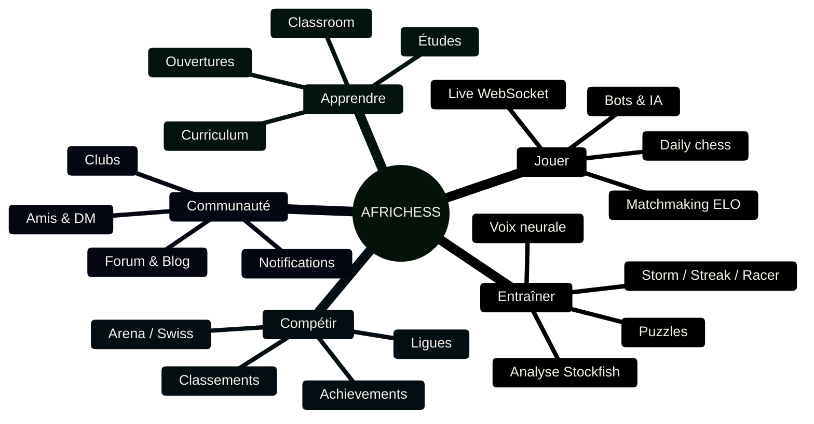
```mermaid
%%{init: {
  "theme": "base",
  "themeVariables": {
    "primaryColor": "#1B7A3D",
    "primaryTextColor": "#F5F0E8",
    "primaryBorderColor": "#D4A017",
    "lineColor": "#D4A017",
    "secondaryColor": "#0A0E14",
    "tertiaryColor": "#161B22",
    "background": "#0A0E14",
    "mainBkg": "#121820",
    "nodeBorder": "#D4A017",
    "clusterBkg": "#0D1117",
    "titleColor": "#D4A017",
    "edgeLabelBackground": "#0D1117"
  }
}}%%
mindmap
  root((AFRICHESS))
    Jouer
      Live WebSocket
      Matchmaking ELO
      Bots & IA
      Daily chess
    Entraîner
      Puzzles
      Storm / Streak / Racer
      Analyse Stockfish
      Voix neurale
    Apprendre
      Curriculum
      Ouvertures
      Études
      Classroom
    Compétir
      Arena / Swiss
      Ligues
      Classements
      Achievements
    Communauté
      Clubs
      Amis & DM
      Forum & Blog
      Notifications
```

---

## Stack technique

| Couche | Technologies | Rôle |
|--------|--------------|------|
| **Frontend web** | Next.js 14 · React 18 · TypeScript · Tailwind · Zustand · chess.js · react-chessboard | UI, plateau, état client, i18n |
| **Mobile** | Flutter (Android + iOS) | Parité API web — voir `mobile/PARITY.md` |
| **API** | Django 5 · DRF · SimpleJWT · dj-rest-auth · allauth | REST, auth, OAuth, abonnements |
| **Temps réel** | Django Channels · Daphne · channels-redis | Parties, matchmaking, notifs |
| **Jobs** | Celery · django-celery-beat | Forfaits, analyses async, tâches planifiées |
| **Données** | PostgreSQL 16 · Redis 7 | Persistance + cache / broker / pub-sub |
| **Moteur** | Stockfish (+ python-chess) | IA, analyse, évaluation |
| **Audio** | edge-tts (voix neurale FR) | Commentaires / revue parlée |
| **Paiements** | Stripe | Premium Gold / Diamond |
| **Observabilité** | Prometheus · Grafana · Sentry | Métriques, alertes, erreurs |
| **Livraison** | Docker Compose · GitHub Actions · K8s / ECS (infra/) | Dev local → prod |

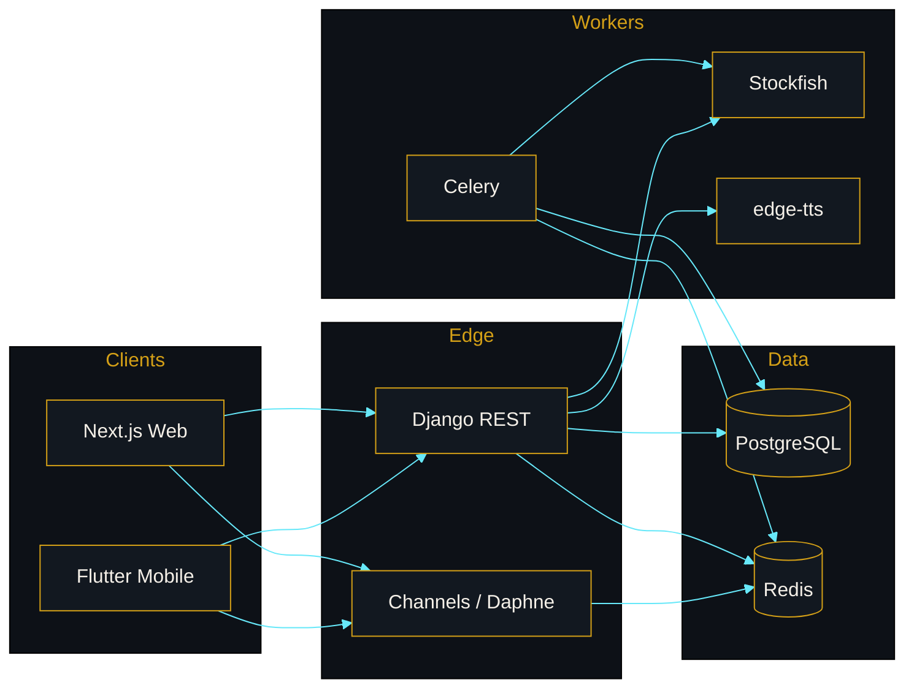
```mermaid
%%{init: {
  "theme": "base",
  "themeVariables": {
    "primaryColor": "#1B7A3D",
    "primaryTextColor": "#F5F0E8",
    "primaryBorderColor": "#D4A017",
    "lineColor": "#67E8F9",
    "secondaryColor": "#C45C26",
    "tertiaryColor": "#161B22",
    "background": "#0A0E14",
    "mainBkg": "#121820",
    "nodeBorder": "#D4A017",
    "clusterBkg": "#0D1117",
    "titleColor": "#D4A017"
  }
}}%%
flowchart LR
  subgraph Clients
    WEB[Next.js Web]
    MOB[Flutter Mobile]
  end
  subgraph Edge
    API[Django REST]
    WS[Channels / Daphne]
  end
  subgraph Data
    PG[(PostgreSQL)]
    RD[(Redis)]
  end
  subgraph Workers
    CEL[Celery]
    SF[Stockfish]
    TTS[edge-tts]
  end
  WEB --> API
  WEB --> WS
  MOB --> API
  MOB --> WS
  API --> PG
  API --> RD
  WS --> RD
  CEL --> PG
  CEL --> RD
  CEL --> SF
  API --> SF
  API --> TTS
```

---

## Architecture

### Vue d’ensemble

Le monorepo sépare clairement :

| Dossier | Contenu |
|---------|---------|
| `frontend/` | App Next.js (App Router), design system, plateau, pages produit |
| `backend/` | Django apps métier (`games`, `users`, `puzzles`, `learning`, `social`…) |
| `mobile/` | Client Flutter |
| `anticheat-cpp/` | Binaire fair-play (télémétrie / heuristiques) |
| `infra/` | Compose prod, K8s, ECS, Grafana, Prometheus |
| `docs/` | Setup, API, WebSocket, déploiement, learning |
| `scripts/` | Bootstraps (`dev-all`, `dev-hybrid`) |

### Backend (apps Django)

Les domaines sont découpés pour isoler responsabilités et tests :

- **users** — comptes, profils, 2FA, Premium, OAuth
- **games** — parties, coups, horloges, commentaires live, TTS
- **puzzles** — catalogue, thèmes, modes storm/streak/racer
- **learning** — curriculum, progression, glossaire
- **ratings** — ELO / classements
- **tournaments / arena** — compétitions
- **social** — amis, clubs, messages, forum
- **notifications** — push / WebSocket
- **analytics** — stats joueur
- **common** — utilitaires partagés

### Frontend (parcours)

Le shell global (`Navbar`, `Footer`, `Providers`) enveloppe des routes immersives (`/play`, `/puzzles`, …). Les stores Zustand hydratent côté client (SSR-safe) pour éviter les erreurs d’hydratation.

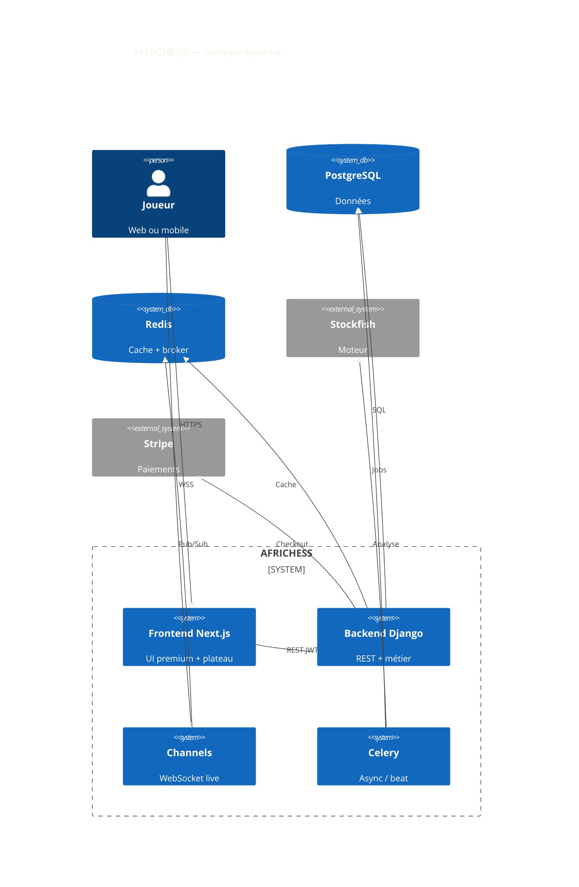
```mermaid
%%{init: {
  "theme": "base",
  "themeVariables": {
    "primaryColor": "#121820",
    "primaryTextColor": "#F5F0E8",
    "primaryBorderColor": "#D4A017",
    "lineColor": "#1B7A3D",
    "secondaryColor": "#1B7A3D",
    "tertiaryColor": "#C45C26",
    "background": "#0A0E14",
    "mainBkg": "#0D1117",
    "nodeBorder": "#D4A017",
    "clusterBkg": "#0A0E14",
    "titleColor": "#D4A017",
    "actorBkg": "#1B7A3D",
    "actorBorder": "#D4A017",
    "actorTextColor": "#F5F0E8",
    "signalColor": "#67E8F9",
    "signalTextColor": "#F5F0E8"
  }
}}%%
C4Context
  title AFRICHESS — contexte système
  Person(player, "Joueur", "Web ou mobile")
  System_Boundary(africhess, "AFRICHESS") {
    System(web, "Frontend Next.js", "UI premium + plateau")
    System(api, "Backend Django", "REST + métier")
    System(rt, "Channels", "WebSocket live")
    System(jobs, "Celery", "Async / beat")
  }
  SystemDb(pg, "PostgreSQL", "Données")
  SystemDb(redis, "Redis", "Cache + broker")
  System_Ext(sf, "Stockfish", "Moteur")
  System_Ext(stripe, "Stripe", "Paiements")
  Rel(player, web, "HTTPS")
  Rel(player, rt, "WSS")
  Rel(web, api, "REST JWT")
  Rel(api, pg, "SQL")
  Rel(api, redis, "Cache")
  Rel(rt, redis, "Pub/Sub")
  Rel(jobs, pg, "Jobs")
  Rel(jobs, sf, "Analyse")
  Rel(api, stripe, "Checkout")
```

---

## Fonctionnalités

### Jouer

| Capacité | Détail |
|----------|--------|
| Modes | Bullet, Blitz, Rapid, Daily / correspondence |
| Matchmaking | File Redis, appariement ELO, rated / casual |
| Bots | Échelle de bots (débutant → élite), déblocage progressif |
| Plateau | Coups légaux, pendules, prises, échec/mat animés |
| Fin de partie | Abandon, nulle, flag, abort, rematch |
| Revue | Analyse Stockfish, commentaires IA, **voix neurale** automatique |

### Puzzles & entraînement

| Capacité | Détail |
|----------|--------|
| Catalogue | 10 000+ problèmes seedés (données ouvertes + catalogue local) |
| Modes | Puzzle du jour, Streak, Storm, Racer, thèmes |
| UX | Célébrations, progression type « jardin », hints animés |
| Stats | Elo puzzle, séries, dashboards |

### Apprentissage

| Capacité | Détail |
|----------|--------|
| Curriculum | Parcours structuré (dizaines de documents FR) |
| Outils | Coordonnées, ouvertures, répertoires, études, glossaire |
| Classroom | Cours / coaching |
| Insights | Retours sur le jeu |

### Compétition & social

| Capacité | Détail |
|----------|--------|
| Tournois | Arena, Swiss, simul, événements, ligues |
| Classements | Leaderboards globaux / régionaux |
| Social | Amis, DM, clubs, forum, blog, streamers |
| Premium | Tiers Gold / Diamond (Stripe), limites d’analyse |

```mermaid
%%{init: {
  "theme": "base",
  "themeVariables": {
    "primaryColor": "#1B7A3D",
    "primaryTextColor": "#F5F0E8",
    "primaryBorderColor": "#D4A017",
    "lineColor": "#D4A017",
    "secondaryColor": "#C45C26",
    "tertiaryColor": "#161B22",
    "background": "#0A0E14",
    "mainBkg": "#121820",
    "nodeBorder": "#D4A017",
    "clusterBkg": "#0D1117",
    "titleColor": "#D4A017"
  }
}}%%
flowchart TB
  HOME[Accueil premium]
  HOME --> PLAY[/play Lobby]
  HOME --> PUZ[/puzzles]
  HOME --> LEARN[/learning]
  HOME --> COM[/community]
  PLAY --> LIVE[Partie WebSocket]
  PLAY --> BOTS[/bots]
  PLAY --> TOUR[Tournois]
  LIVE --> END[Fin de partie]
  END --> REVIEW[Revue + voix IA]
  PUZ --> STORM[Storm / Streak / Racer]
  LEARN --> CURR[Curriculum]
  COM --> CLUBS[Clubs & forum]
```

---

## Flux temps réel

### Authentification WebSocket

Les connexions live utilisent le protocole :

```text
Sec-WebSocket-Protocol: bearer,<access_jwt>
```

(`?token=` uniquement si `WS_ALLOW_QUERY_TOKEN=true`, déconseillé en production.)

### Canaux principaux

| Canal | Endpoint | Usage |
|-------|----------|-------|
| Partie | `ws://…/ws/game/<uuid>/` | Coups, horloge, chat, états |
| Matchmaking | `ws://…/ws/matchmaking/` | File d’attente / appariement |
| Notifications | `ws://…/ws/notifications/` | Alertes temps réel |

### Parcours type d’une partie live

1. Le joueur s’authentifie (JWT)
2. Il rejoint le matchmaking ou accepte un défi
3. Le serveur crée la partie et pousse l’UUID
4. Les deux clients ouvrent le WS `game`
5. Chaque coup valide met à jour FEN, pendules, commentaires
6. Fin de partie → review + éventuelle analyse async Celery

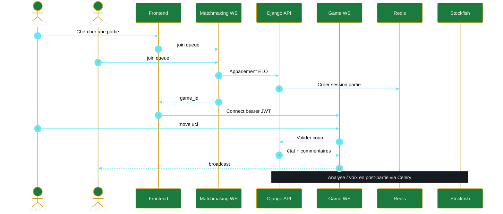
```mermaid
%%{init: {
  "theme": "base",
  "themeVariables": {
    "actorBkg": "#1B7A3D",
    "actorBorder": "#D4A017",
    "actorTextColor": "#F5F0E8",
    "signalColor": "#67E8F9",
    "signalTextColor": "#0A0E14",
    "labelBoxBkgColor": "#121820",
    "labelTextColor": "#F5F0E8",
    "noteBkgColor": "#161B22",
    "noteTextColor": "#F5F0E8",
    "activationBkgColor": "#1B7A3D",
    "sequenceNumberColor": "#D4A017"
  }
}}%%
sequenceDiagram
  autonumber
  actor J1 as Joueur A
  actor J2 as Joueur B
  participant FE as Frontend
  participant MM as Matchmaking WS
  participant API as Django API
  participant GWS as Game WS
  participant RD as Redis
  participant SF as Stockfish

  J1->>FE: Chercher une partie
  FE->>MM: join queue
  J2->>MM: join queue
  MM->>API: Appariement ELO
  API->>RD: Créer session partie
  MM-->>FE: game_id
  FE->>GWS: Connect bearer JWT
  J1->>GWS: move uci
  GWS->>API: Valider coup
  API-->>GWS: état + commentaires
  GWS-->>J2: broadcast
  Note over API,SF: Analyse / voix en post-partie via Celery
```

---

## Design system & UX premium

### Identité visuelle

| Token | Valeur | Usage |
|-------|--------|-------|
| Or | `#D4A017` | Accents, CTA secondaires, titres |
| Vert | `#1B7A3D` | CTA primaires, succès |
| Terracotta | `#C45C26` | Accent chaud du dégradé |
| Night | `#0A0E14` / `#121820` | Fonds dark |
| Cream | `#F3EDE3` / `#FAF7F2` | Fonds light chauds |

### Typographie

- **Display** — Cormorant Garamond (`next/font`)
- **Body** — DM Sans

### Motion (fluide, pas lourd)

- Animations CSS (`opacity` / `transform`) — pas de lib lourde sur l’accueil
- Hero : logo flottant, orbes, titre en blur-in, CTA pulse
- Cartes : reveal au scroll (`IntersectionObserver`), shimmer hover
- Menu « Plus » : overlay fade + panneau slide + colonnes stagger
- Modes **low-bandwidth** et **prefers-reduced-motion** : animations coupées

### Composants UI

- `Button` / `ButtonLink` — `primary` · `secondary` · `ghost` · `hero`
- `Reveal` — apparition au scroll
- `glass-card` · `feature-card` · `nav-premium` · `footer-premium`


```mermaid
%%{init: {
  "theme": "base",
  "themeVariables": {
    "primaryColor": "#D4A017",
    "primaryTextColor": "#0A0E14",
    "primaryBorderColor": "#1B7A3D",
    "lineColor": "#C45C26",
    "secondaryColor": "#1B7A3D",
    "tertiaryColor": "#F5F0E8",
    "background": "#0A0E14",
    "mainBkg": "#121820",
    "nodeBorder": "#D4A017",
    "clusterBkg": "#0D1117",
    "titleColor": "#D4A017"
  }
}}%%
flowchart LR
  subgraph Tokens
    C[Couleurs or/vert/terracotta]
    T[Fonts display + body]
    S[Ombres premium]
  end
  subgraph Primitives
    B[Buttons]
    G[Glass cards]
    R[Reveal]
  end
  subgraph Surfaces
    H[Hero animé]
    N[Navbar + mega-menu]
    F[Footer]
    P[Pages produit]
  end
  Tokens --> Primitives --> Surfaces
```

---

## Démarrage

### Prérequis

- Docker & Docker Compose **(recommandé)**
- Ou : Python 3.12+ · Node 20+ · PostgreSQL 16 · Redis 7 · Stockfish

### Une commande

```bash
cd AFRICHESS
cp .env.example .env
make bootstrap   # ou ./scripts/dev-all.sh
```

### Docker Compose (services)

```bash
docker compose up --build
# ou stack partielle :
make up          # db redis backend celery celery-beat
make frontend    # Next.js sur :3000
```

| Service | URL |
|---------|-----|
| Frontend | http://localhost:3000 |
| API | http://localhost:8000/api/ |
| Swagger | http://localhost:8000/api/docs/ |
| Admin | http://localhost:8000/admin/ |

```bash
make superuser
make demo        # utilisateur demo / demo1234
```

### Frontend seul

```bash
cd frontend
npm install
npm run dev          # utilise .next-build
npm run dev:clean    # purge cache puis démarre
```

> **Important** : ne pas lancer `npm run build` (dossier `.next`) en même temps qu’un `npm run dev` sur le même cache — cela provoque des 404 sur les chunks JS. Le script `build` écrit dans `.next` ; le dev utilise `.next-build`.

### Backend local (hors Docker)

```bash
cd backend
python -m venv .venv && source .venv/bin/activate
pip install -r requirements.txt
export DJANGO_SETTINGS_MODULE=config.settings.development
python manage.py migrate
python manage.py seed_puzzles --download
python manage.py createsuperuser
daphne -b 0.0.0.0 -p 8000 config.asgi:application
```

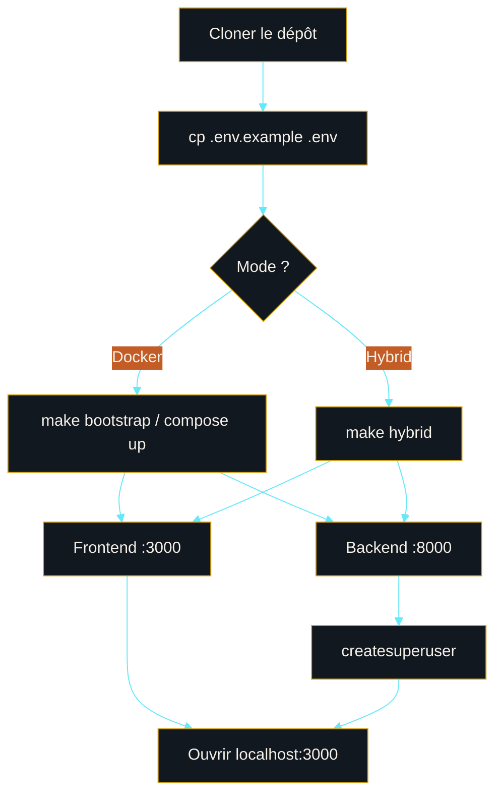
```mermaid
%%{init: {
  "theme": "base",
  "themeVariables": {
    "primaryColor": "#1B7A3D",
    "primaryTextColor": "#F5F0E8",
    "primaryBorderColor": "#D4A017",
    "lineColor": "#67E8F9",
    "secondaryColor": "#C45C26",
    "background": "#0A0E14",
    "mainBkg": "#121820",
    "nodeBorder": "#D4A017",
    "clusterBkg": "#0D1117",
    "titleColor": "#D4A017"
  }
}}%%
flowchart TD
  A[Cloner le dépôt] --> B[cp .env.example .env]
  B --> C{Mode ?}
  C -->|Docker| D[make bootstrap / compose up]
  C -->|Hybrid| E[make hybrid]
  D --> F[Backend :8000]
  D --> G[Frontend :3000]
  E --> F
  E --> G
  F --> H[createsuperuser]
  G --> I[Ouvrir localhost:3000]
  H --> I
```

---

## API & WebSocket

Docs interactives : `GET /api/docs/`  
Santé publique : `GET /api/health/`

### Auth

| Méthode | Endpoint | Description |
|---------|----------|-------------|
| POST | `/api/auth/login/` | Login (+ TOTP optionnel) |
| POST | `/api/auth/logout/` | Logout + denylist |
| POST | `/api/auth/token/refresh/` | Refresh JWT |
| POST | `/api/users/register/` | Inscription |
| POST | `/api/users/auth/oauth/exchange/` | OAuth → tokens |

Header : `Authorization: Bearer <access>`

### Parties (extrait)

| Méthode | Endpoint | Description |
|---------|----------|-------------|
| POST | `/api/games/matchmaking/` | Rejoindre la file |
| DELETE | `/api/games/matchmaking/` | Quitter la file |
| POST | `/api/games/ai/` | Partie vs IA / bot |
| GET | `/api/games/<uuid>/` | Détail |
| POST | `/api/games/<uuid>/move/` | Coup `{uci, …}` |
| POST | `/api/games/<uuid>/resign/` | Abandon |
| POST | `/api/games/<uuid>/draw/` | Proposition nulle |
| POST | `/api/games/<uuid>/analyze/` | Analyse sync |
| POST | `/api/games/<uuid>/analyze/async/` | Analyse cloud async |

Référence complète : [`docs/API.md`](docs/API.md) · WebSocket : [`docs/WEBSOCKET_MULTIPLAYER.md`](docs/WEBSOCKET_MULTIPLAYER.md)

```mermaid
%%{init: {
  "theme": "base",
  "themeVariables": {
    "primaryColor": "#121820",
    "primaryTextColor": "#F5F0E8",
    "primaryBorderColor": "#D4A017",
    "lineColor": "#1B7A3D",
    "secondaryColor": "#1B7A3D",
    "background": "#0A0E14",
    "mainBkg": "#0D1117",
    "nodeBorder": "#D4A017",
    "clusterBkg": "#0A0E14",
    "titleColor": "#D4A017"
  }
}}%%
flowchart LR
  CLIENT[Client]
  CLIENT -->|JWT REST| AUTH[/api/auth/*]
  CLIENT -->|Bearer| GAMES[/api/games/*]
  CLIENT -->|Bearer| USERS[/api/users/*]
  CLIENT -->|Bearer| PUZ[/api/puzzles/*]
  CLIENT -->|WSS bearer| WS1[/ws/game/uuid]
  CLIENT -->|WSS| WS2[/ws/matchmaking]
  CLIENT -->|WSS| WS3[/ws/notifications]
```

---

## Application mobile

Le dossier `mobile/` contient une app **Flutter** (Android + iOS) branchée sur la même API. L’ancien client Expo est archivé dans `mobile_expo_legacy/`.

| Élément | Détail |
|---------|--------|
| Stack | Flutter · Dart |
| Auth | JWT + deep link OAuth `africhess://auth/callback` |
| Docs | [`mobile/README.md`](mobile/README.md) · [`mobile/PARITY.md`](mobile/PARITY.md) |

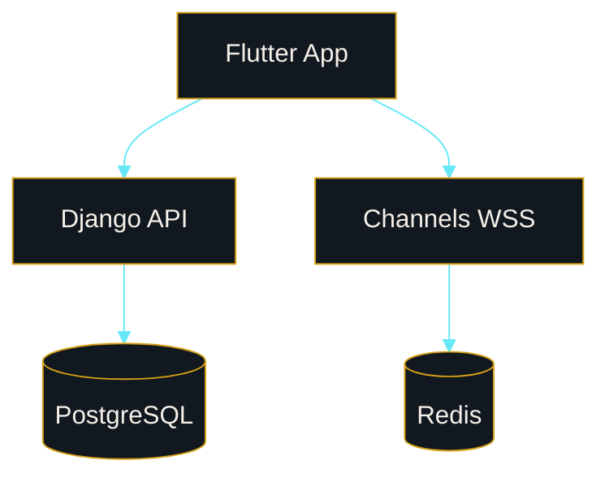
```mermaid
%%{init: {
  "theme": "base",
  "themeVariables": {
    "primaryColor": "#1B7A3D",
    "primaryTextColor": "#F5F0E8",
    "primaryBorderColor": "#D4A017",
    "lineColor": "#67E8F9",
    "background": "#0A0E14",
    "mainBkg": "#121820",
    "nodeBorder": "#D4A017",
    "clusterBkg": "#0D1117",
    "titleColor": "#D4A017"
  }
}}%%
flowchart TB
  FLUTTER[Flutter App] --> API[Django API]
  FLUTTER --> WS[Channels WSS]
  API --> PG[(PostgreSQL)]
  WS --> RD[(Redis)]
```

---

## Tests & qualité

| Couche | Outil | Commande typique |
|--------|-------|------------------|
| Frontend unit | Vitest | `cd frontend && npm test` |
| Frontend e2e | Playwright | `npm run test:e2e` |
| Mobile | Flutter test | `make mobile-test` |
| Backend | Django test | `python manage.py test` |
| Types | `tsc` | `npm run typecheck` |
| Lint | ESLint / Next | `npm run lint` |
| CI | GitHub Actions | [`.github/workflows/ci.yml`](.github/workflows/ci.yml) |

Les parcours critiques (coups, nulles, voix live / review, hydratation SSR, menu nav) sont couverts par des tests dédiés côté front et back.

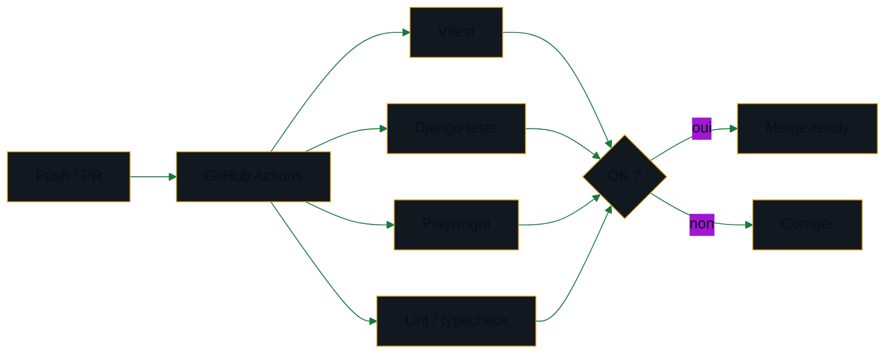
```mermaid
%%{init: {
  "theme": "base",
  "themeVariables": {
    "primaryColor": "#D4A017",
    "primaryTextColor": "#0A0E14",
    "primaryBorderColor": "#1B7A3D",
    "lineColor": "#1B7A3D",
    "background": "#0A0E14",
    "mainBkg": "#121820",
    "nodeBorder": "#D4A017",
    "clusterBkg": "#0D1117",
    "titleColor": "#D4A017"
  }
}}%%
flowchart LR
  PUSH[Push / PR] --> CI[GitHub Actions]
  CI --> UT[Vitest]
  CI --> DJ[Django tests]
  CI --> E2E[Playwright]
  CI --> LINT[Lint / typecheck]
  UT --> GATE{OK ?}
  DJ --> GATE
  E2E --> GATE
  LINT --> GATE
  GATE -->|oui| MERGE[Merge-ready]
  GATE -->|non| FIX[Corriger]
```

---

## Infrastructure & déploiement

| Environnement | Artefacts |
|---------------|-----------|
| Dev local | `docker-compose.yml` · `Makefile` |
| Prod compose | `infra/docker-compose.production.yml` |
| Kubernetes | `infra/k8s/` (API, WS, Celery, HPA, Ingress, PgBouncer…) |
| AWS ECS | `infra/ecs/` |
| Observabilité | Prometheus · Grafana dashboards & alertes |

Guides : [`docs/DEPLOYMENT.md`](docs/DEPLOYMENT.md) · [`docs/ARCHITECTURE_SCALE.md`](docs/ARCHITECTURE_SCALE.md) · [`infra/README.md`](infra/README.md)

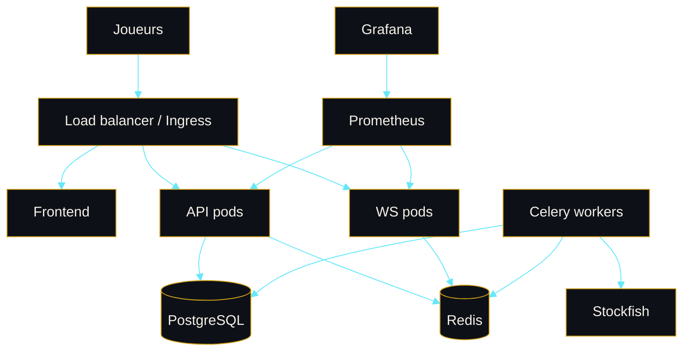
```mermaid
%%{init: {
  "theme": "base",
  "themeVariables": {
    "primaryColor": "#121820",
    "primaryTextColor": "#F5F0E8",
    "primaryBorderColor": "#D4A017",
    "lineColor": "#67E8F9",
    "secondaryColor": "#1B7A3D",
    "background": "#0A0E14",
    "mainBkg": "#0D1117",
    "nodeBorder": "#D4A017",
    "clusterBkg": "#0A0E14",
    "titleColor": "#D4A017"
  }
}}%%
flowchart TB
  USERS[Joueurs] --> LB[Load balancer / Ingress]
  LB --> WEB[Frontend]
  LB --> API[API pods]
  LB --> WS[WS pods]
  API --> PG[(PostgreSQL)]
  API --> RD[(Redis)]
  WS --> RD
  CEL[Celery workers] --> PG
  CEL --> RD
  CEL --> SF[Stockfish]
  PROM[Prometheus] --> API
  PROM --> WS
  GRAF[Grafana] --> PROM
```

---

## Structure du dépôt

```text
AFRICHESS/
├── frontend/          # Next.js 14 — UI premium
├── backend/           # Django 5 — API + Channels + Celery
├── mobile/            # Flutter (Android + iOS)
├── mobile_expo_legacy/ # Ancien client Expo (référence)
├── anticheat-cpp/     # Fair-play natif
├── infra/             # K8s, ECS, Grafana, Prometheus
├── docs/              # Documentation produit & technique
├── scripts/           # Bootstrap / hybrid
├── docker-compose.yml
├── Makefile
└── README.md          # ← vous êtes ici
```

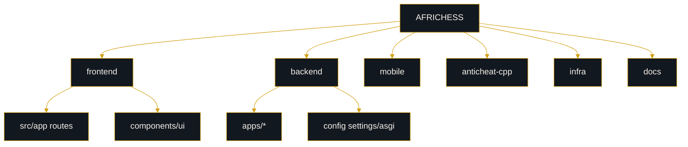
```mermaid
%%{init: {
  "theme": "base",
  "themeVariables": {
    "primaryColor": "#1B7A3D",
    "primaryTextColor": "#F5F0E8",
    "primaryBorderColor": "#D4A017",
    "lineColor": "#D4A017",
    "background": "#0A0E14",
    "mainBkg": "#121820",
    "nodeBorder": "#D4A017",
    "clusterBkg": "#0D1117",
    "titleColor": "#D4A017"
  }
}}%%
flowchart TB
  ROOT[AFRICHESS]
  ROOT --> FE[frontend]
  ROOT --> BE[backend]
  ROOT --> MO[mobile]
  ROOT --> AC[anticheat-cpp]
  ROOT --> IN[infra]
  ROOT --> DO[docs]
  FE --> FEAPP[src/app routes]
  FE --> FEUI[components/ui]
  BE --> APPS[apps/*]
  BE --> CFG[config settings/asgi]
```

---

## Sécurité & fair play

| Mesure | Détail |
|--------|--------|
| Auth | JWT access + refresh (option HttpOnly) |
| 2FA | TOTP setup / enable / disable |
| WS | Bearer via `Sec-WebSocket-Protocol` |
| CORS | Origines explicites |
| Secrets | `.env` / secrets K8s — jamais commités |
| Fair play | Binaire `anticheat-cpp` + télémétrie coups |
| Paiements | Stripe webhooks signés |
| Privacy | [`docs/POLITIQUE_CONFIDENTIALITE.md`](docs/POLITIQUE_CONFIDENTIALITE.md) |

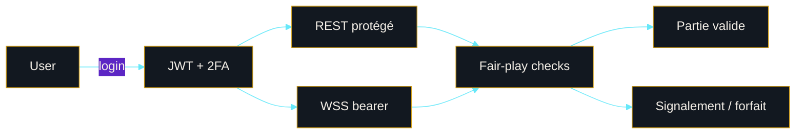
```mermaid
%%{init: {
  "theme": "base",
  "themeVariables": {
    "primaryColor": "#C45C26",
    "primaryTextColor": "#F5F0E8",
    "primaryBorderColor": "#D4A017",
    "lineColor": "#67E8F9",
    "background": "#0A0E14",
    "mainBkg": "#121820",
    "nodeBorder": "#D4A017",
    "clusterBkg": "#0D1117",
    "titleColor": "#D4A017"
  }
}}%%
flowchart LR
  U[User] -->|login| JWT[JWT + 2FA]
  JWT --> REST[REST protégé]
  JWT --> WSS[WSS bearer]
  REST --> FP[Fair-play checks]
  WSS --> FP
  FP --> OK[Partie valide]
  FP --> FLAG[Signalement / forfait]
```

---

## Roadmap

Voir aussi [`ROADMAP.md`](ROADMAP.md) et [`docs/FEATURES_ROADMAP.md`](docs/FEATURES_ROADMAP.md).

| Horizon | Axes |
|---------|------|
| Court | Polish UX global, perf live, couverture e2e élargie |
| Moyen | Liquidité matchmaking, mobile feature-parity, classroom |
| Long | Scale multi-région, anti-triche avancé, écosystème clubs |

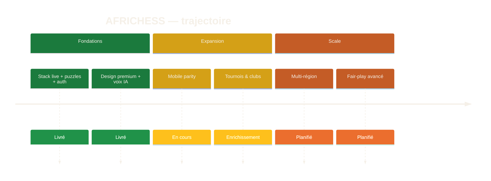
```mermaid
%%{init: {
  "theme": "base",
  "themeVariables": {
    "primaryColor": "#1B7A3D",
    "primaryTextColor": "#F5F0E8",
    "primaryBorderColor": "#D4A017",
    "lineColor": "#D4A017",
    "background": "#0A0E14",
    "mainBkg": "#121820",
    "nodeBorder": "#D4A017",
    "clusterBkg": "#0D1117",
    "titleColor": "#D4A017",
    "cScale0": "#1B7A3D",
    "cScale1": "#D4A017",
    "cScale2": "#C45C26"
  }
}}%%
timeline
  title AFRICHESS — trajectoire
  section Fondations
    Stack live + puzzles + auth : Livré
    Design premium + voix IA : Livré
  section Expansion
    Mobile parity : En cours
    Tournois & clubs : Enrichissement
  section Scale
    Multi-région : Planifié
    Fair-play avancé : Planifié
```

---

## Crédits

<div align="center">

**AFRICHESS** — conçu et développé par **Maxime Dzidula KELI**

[WhatsApp +33 7 54 83 00 39](https://wa.me/33754830039)

<br/>

| Doc | Lien |
|-----|------|
| Setup | [`docs/SETUP.md`](docs/SETUP.md) |
| API | [`docs/API.md`](docs/API.md) |
| WebSocket | [`docs/WEBSOCKET_MULTIPLAYER.md`](docs/WEBSOCKET_MULTIPLAYER.md) |
| Learning | [`docs/LEARNING.md`](docs/LEARNING.md) |
| Déploiement | [`docs/DEPLOYMENT.md`](docs/DEPLOYMENT.md) |
| Privacy | [`docs/PRIVACY_POLICY.md`](docs/PRIVACY_POLICY.md) |

<br/>


</div>

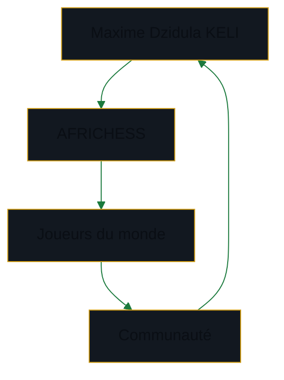
```mermaid
%%{init: {
  "theme": "base",
  "themeVariables": {
    "primaryColor": "#D4A017",
    "primaryTextColor": "#0A0E14",
    "primaryBorderColor": "#1B7A3D",
    "lineColor": "#1B7A3D",
    "background": "#0A0E14",
    "mainBkg": "#121820",
    "nodeBorder": "#D4A017",
    "clusterBkg": "#0D1117",
    "titleColor": "#D4A017"
  }
}}%%
flowchart TB
  DEV[Maxime Dzidula KELI] --> PROD[AFRICHESS]
  PROD --> PLAYERS[Joueurs du monde]
  PLAYERS --> COMMUNITY[Communauté]
  COMMUNITY --> DEV
```

---

<div align="center">

**© AFRICHESS** — Élever le jeu d’échecs sur la scène mondiale.

</div>
